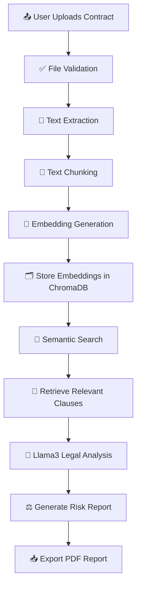

<div align="center">

# ⚖️ AI Legal Risk Analyzer

### AI-Powered Legal Contract Analysis with Retrieval-Augmented Generation

An intelligent system that lets users upload legal contracts, run semantic search over clauses, and generate AI-driven legal risk assessments — powered entirely by a **local LLM**, with no data ever leaving your machine.

[](https://www.python.org/)
[](https://streamlit.io/)
[](https://ollama.com/)
[](https://www.trychroma.com/)
[](https://www.sqlite.org/)
[](#license)

</div>

---

## 📌 Table of Contents

- [Overview](#-overview)
- [Features](#-features)
- [Technology Stack](#-technology-stack)
- [AI Processing Workflow](#-ai-processing-workflow)
- [Project Structure](#-project-structure)
- [Installation](#-installation)
- [Sample Documents](#-sample-documents)
- [Future Improvements](#-future-improvements)
- [Author](#-author)

---

## 🧠 Overview

**AI Legal Risk Analyzer** combines document intelligence with a Retrieval-Augmented Generation (RAG) pipeline to help users understand legal contracts faster. Upload a contract, ask a plain-language question, and get back the most relevant clauses along with an AI-generated risk assessment — grounded strictly in the retrieved text, not hallucinated.

> Built for accuracy, transparency, and full local control — every step of the pipeline, from embedding to inference, runs on your own infrastructure.

---

## ✨ Features

| Category | Capability |
|---|---|
| 🔐 **Authentication** | Secure user login & session management |
| 📤 **Upload** | Supports PDF, DOCX, and TXT contracts |
| 🔍 **Extraction** | Automatic text extraction from documents |
| 🧩 **Chunking** | Intelligent, context-aware text chunking |
| 🧠 **Embeddings** | Dense vector embeddings for semantic understanding |
| 🗂️ **Vector Store** | ChromaDB-powered vector database |
| 🔎 **Semantic Search** | Retrieves the most relevant clauses per query |
| ⚖️ **Risk Analysis** | AI-generated legal risk assessment via local LLM |
| 📜 **History** | Full analysis history per user/document |
| 📄 **PDF Export** | One-click export of analysis reports |

---

## 🛠️ Technology Stack

<table>
<tr>
<td valign="top" width="50%">

**Frontend**
- Streamlit

**Backend**
- Python

**Database**
- SQLite
- SQLAlchemy

**Vector Database**
- ChromaDB

</td>
<td valign="top" width="50%">

**Embedding Model**
- Sentence Transformers
- `all-MiniLM-L6-v2`

**Large Language Model**
- Ollama
- `Llama3:8B`

**Document Processing**
- PyMuPDF
- python-docx

**AI Pipeline**
- Retrieval-Augmented Generation (RAG)

</td>
</tr>
</table>

---

## 🔄 AI Processing Workflow



> **Note:** GitHub renders Mermaid diagrams natively. If viewed elsewhere, the linear flow is:
> `Upload → Validation → Extraction → Chunking → Embeddings → ChromaDB → Semantic Search → Retrieval → Llama3 Analysis → Risk Report → PDF Export`

---

## 📁 Project Structure

```
AI_Legal_Risk_Analyzer/
├── app.py                  # Application entry point
├── auth/                   # Authentication & session logic
├── database/                # Models, CRUD, and DB session handling
├── services/                # Embedding, vector store, search, LLM analyzer
├── utils/                   # PDF export & helper utilities
├── views/                   # Streamlit page views (dashboard, search, history)
├── uploads/                  # User-uploaded contract files
├── tests/                    # Test suite
├── screenshots/               # App screenshots for documentation
├── sample_documents/           # Example legal contracts
├── requirements.txt
└── README.md
```

---

## ⚙️ Installation

```bash
# 1. Clone the repository
git clone https://github.com/USERNAME/AI_Legal_Risk_Analyzer.git
cd AI_Legal_Risk_Analyzer

# 2. Create a virtual environment
python -m venv .venv

# 3. Activate the environment
# Windows:
.venv\Scripts\activate
# macOS/Linux:
source .venv/bin/activate

# 4. Install dependencies
pip install -r requirements.txt

# 5. Initialize the database
python -m database.init_db

# 6. Run the app
streamlit run app.py
```

> 💡 Make sure [Ollama](https://ollama.com/) is installed and running locally with the `llama3:8b` model pulled (`ollama pull llama3:8b`) before launching the app.

---

## 📚 Sample Documents

The project includes ready-to-use sample legal contracts inside the [`sample_documents/`](./sample_documents) folder — ideal for quickly testing upload, search, and analysis features without needing your own files.

---

## 🚀 Future Improvements

- [ ] Multi-document retrieval & cross-contract comparison
- [ ] OCR support for scanned contracts
- [ ] Automated clause classification
- [ ] Interactive risk scoring dashboard
- [ ] Cloud deployment (Docker + CI/CD)
- [ ] JWT-based authentication
- [ ] Multi-agent legal analysis pipeline

---

## 👤 Author

**Talha Abdul Rauf**
AI Engineer · Python · RAG · LLM · Streamlit · ChromaDB

[](#)
[](#)

---

<div align="center">

*If you found this project useful, consider giving it a ⭐ on GitHub!*

</div>
